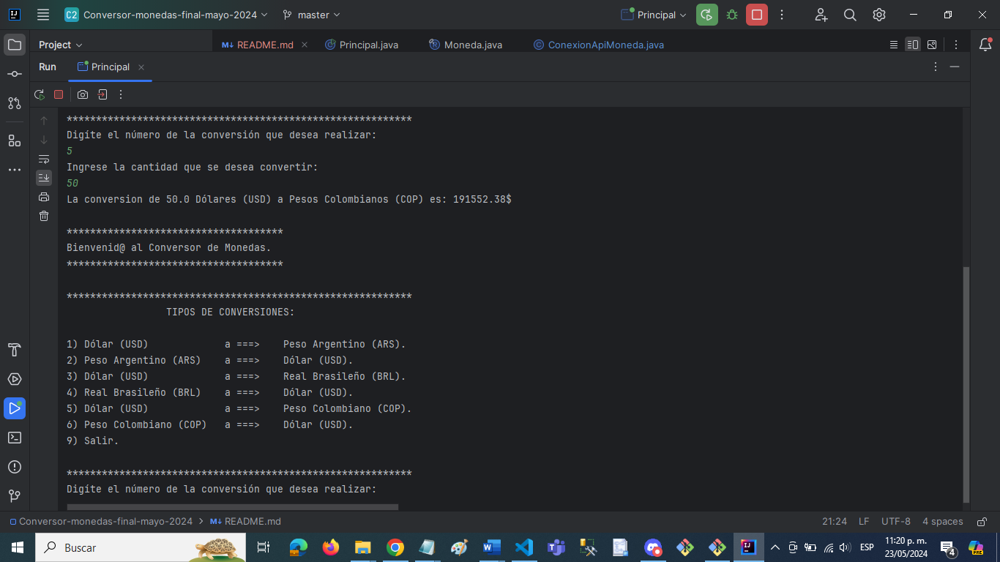

# Conversor de Moneda

Challenge #1: Conversor de Monedas.
En este proyecto se realizará un desafío y/o challenge en el lenguaje JAVA Orientado a Objetos, 
con el cuál, se desarrollará un Conversor de Monedas basado en el consumo de una API.

## Funcionalidades

- Conversión de una moneda base a una moneda de destino.
- Continuación del proceso de conversión o salida del programa.

## Archivos en SRC:

- 1). Clase ConexiónApiMoneda: Archivo donde se encuentra la apikey y URL de la conexión a la Api coversor de monedas.
- 2). Clase Principal: - Archivo donde se realiza la creación de los objetos e instanciación de los métodos creados.
                       - Menú de opciones para la conversión de las monedas.
- 3). Record Moneda: Archivo donde se estan los atributos para el proceso de la conversión de las monedas.

## Menú de Opciones

## Conversión Monedas

## Validación número menú:

## Salida Aplicación.

